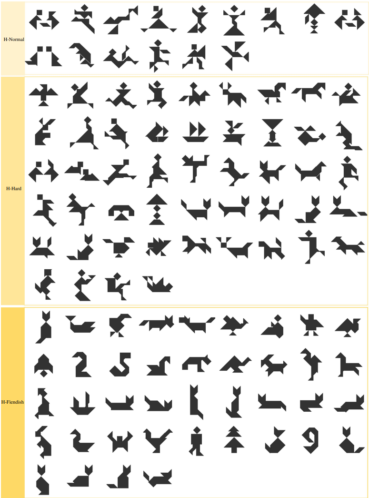

## Master Rules from Chaos: Learning to Reason, Plan, and Interact from Chaos for Tangram Assembly

## 104 Human-created Objects

## Video

 <iframe width="640" height="360" src="https://github.com/RobotLL/MasterRulesFromChaos/assets/32490390/836f0c4c-c94e-41c1-a4fd-d83f74bfa69f" frameborder="0" allow="accelerometer; autoplay; clipboard-write; encrypted-media; gyroscope; picture-in-picture" allowfullscreen></iframe>
 

## Code
Code will be available afterward [here](https://github.com/RobotLL/MasterRulesFromChaos) 

  
